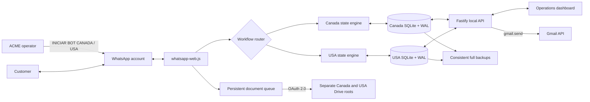

# MultiServicios Visa Intake Automation

Local-first, cloud-connected workflow automation for collecting Canadian and United States visa information, tracking each case, and routing documents from WhatsApp to Google Drive.

This project demonstrates a pragmatic DevOps approach to a real ACME business problem: reducing repetitive follow-up, manual document handling, and incomplete customer files without introducing unnecessary infrastructure.

> **Status:** Functional multi-workflow MVP<br>
> **Runtime:** Windows workstation<br>
> **Architecture:** Local application + managed cloud storage<br>
> **Primary interface:** WhatsApp and a local operations dashboard

## Business problem

ACME personnel need to collect long, structured sets of customer information and supporting documents. A completely manual process creates recurring problems:

- Customers are asked for information they already provided in a document.
- Conversations are interrupted and difficult to resume consistently.
- Missing answers are tracked manually.
- Documents must be downloaded, renamed, and organized by hand.
- Staff lack a single view of case status and completion.

The solution turns that process into a persistent, auditable workflow while preserving human review where it adds value.

## Solution overview

- Canada and USA are independent workflows with separate question catalogs, state engines, SQLite databases, dashboard views, and Google Drive roots. Answers never cross between them.
- The dashboard has tabs for Visa Canada, Visa USA, eTA Canada, and Canadian company registration. Visa Canada and Visa USA are operational; the remaining tabs reserve their own product areas for future workflows.
- Each dashboard tab includes contextual help for starting and stopping its bot, sending requirements, locating Drive files, and using the available tools.
- The bot remains silent until the operator sends `INICIAR BOT CANADA` or `INICIAR BOT USA` in an individual customer chat. One explicitly configured testing phone may also start its own chat.
- Unknown contacts, status messages, broadcasts, and groups receive no automated response.
- ACME obtains the customer's signed authorization before the operator starts the bot; the chat does not repeat that authorization step.
- Questions are delivered one at a time and validated according to their data type.
- Every response and conversation position is persisted, allowing interruption and recovery at any moment.
- After the last dynamic question, the customer gets one final opportunity to report an accidental correction; the case then stops processing that conversation.
- Customers can use `SALTAR`, `ALTO`/`PAUSA`/`PAUSAR`/`DETENTE`/`PARA`, `CONTINUAR`, `RESUMEN`, and `PENDIENTES`.
- Passport images and PDF files are placed in the corresponding customer folder under `Clientes - Visa Canada` or `Clientes - Visa USA`.
- The complete applicant name is collected immediately after the passport so every row is identifiable in the dashboard.
- New expedients ask whether the applicant has previously traveled to Canada. A previous traveler supplies the most recent entry/exit dates and whether Canadian biometrics are registered (`Sí`, `No`, or `No sé`) instead of being asked for a UCI.
- The USA questionnaire uses adaptive sections for additional email and phone history, social networks, employment, education, US destination and family contacts, parents, languages, travel, deportation, and prior visa applications. It validates email, phone, calendar dates, passport chronology, and study/employment periods.
- Lodging and relative questions can reuse a previously supplied US address or phone. Country history is accepted as one comma-separated message and de-duplicated before storage.
- A wide local dashboard exposes the most relevant sortable columns, case status, completion, answers, notes, custom fields, and Drive links. Staff can permanently delete a record after an explicit confirmation, including cases still in progress.
- Family information in both the dashboard and PDF is separated into summary, current partner, previous partner, mother, father, and one block per child.
- Staff can download a client-safe PDF summary or send the same PDF to the confirmed customer email through Gmail for validation.
- The operator can send `Info visa Canada` or `Info Visa USA` to deliver a consistently formatted requirements message with the appropriate country flag.

This phase intentionally excludes health, criminal, political, government, organizational, and military questions. It does not use OCR or generative AI.

## Architecture



The architecture is deliberately hybrid:

- **Local control plane:** customer records, workflow state, audit events, sessions, and the dashboard remain on the ACME workstation.
- **Cloud integration plane:** customer files are organized in Google Drive and validation PDFs can be sent through Gmail using separate, narrowly scoped OAuth permissions.
- **No container dependency:** the MVP runs directly on Windows with Node.js.
- **No database server:** SQLite provides transactions and safe concurrent access while remaining a single portable file.

Detailed design: [architecture](docs/architecture.md) and [engineering decisions](docs/decisions.md).

## Reliability and security controls

- SQLite WAL mode, foreign keys, transactions, and busy-timeout configuration.
- Idempotent WhatsApp message processing.
- Persistent document queue with recovery and exponential retry.
- File-type and file-size validation before upload.
- AES-256-GCM encryption for the Google OAuth token.
- Serialized token writes with Windows-safe replacement and stale-file cleanup.
- Persistent WhatsApp `LocalAuth` session.
- Loopback-only dashboard binding; the application rejects public network binding.
- OAuth request logging disabled so authorization codes do not appear in console output.
- Client PDFs are generated in memory and exclude internal notes before download or email delivery.
- Application data, credentials, sessions, databases, and build output excluded from Git.
- Automated type checking, tests, compilation, dependency auditing, and HTTP smoke testing.

## Technology stack

| Layer | Technology |
|---|---|
| Runtime | Node.js 24 LTS + TypeScript |
| Local API | Fastify |
| Persistence | Built-in `node:sqlite` |
| Messaging | `whatsapp-web.js` + Puppeteer |
| Cloud storage | Google Drive API + OAuth 2.0 |
| Transactional email | Gmail API with `gmail.send` only |
| PDF reports | PDFKit, generated in memory |
| Validation | Zod + domain validators |
| Dashboard | Semantic HTML, CSS, and browser JavaScript |
| Quality gates | Node test runner, TypeScript, npm audit, smoke test |

## Repository structure

```text
src/
  domain/                 Canada/USA engines, catalogs and validation
  infrastructure/         SQLite, WhatsApp, Google Drive and token encryption
  config.ts               Validated environment configuration
  server.ts               Local API and dashboard server
public/                    Operations dashboard
scripts/                   Setup, clean and smoke-test utilities
test/                      Domain and infrastructure tests
docs/                      Architecture and engineering decisions
```

## Local setup

### Prerequisites

- Windows 10 or Windows 11.
- Node.js 24 LTS.
- Google Chrome or Microsoft Edge.
- A dedicated WhatsApp account is recommended.
- A Google Cloud project with Google Drive API and Gmail API enabled.

### 1. Install and create local configuration

```powershell
npm.cmd install
npm.cmd run setup
```

The setup command copies `.env.example` to `.env` and generates a unique encryption key. Never commit `.env`.

### 2. Configure Google OAuth

Create an OAuth 2.0 client of type **Web application** and register a redirect URI that exactly matches the local configuration. Example:

```text
PORT=3000
GOOGLE_REDIRECT_URI=http://127.0.0.1:3000/auth/google/callback
GOOGLE_CLIENT_ID=your_client_id
GOOGLE_CLIENT_SECRET=your_client_secret
ORGANIZATION_NAME=MultiServicios
GOOGLE_DRIVE_ROOT_FOLDER_NAME=Clientes - Visa Canada
GOOGLE_DRIVE_USA_ROOT_FOLDER_NAME=Clientes - Visa USA
```

The full callback belongs under **Authorized redirect URIs**. If a JavaScript origin is configured, it contains only `http://127.0.0.1:3000`. Replace `3000` in both values when using a different local port.

Enable both **Google Drive API** and **Gmail API** in the API Library. In the OAuth consent screen's **Data access** section, add:

```text
https://www.googleapis.com/auth/drive.file
https://www.googleapis.com/auth/gmail.send
```

For a local app in testing, keep the Google account that owns the Drive/Gmail mailbox in the test-user list. Existing Drive-only installations must authorize Google once more from the panel before the first email is sent.

### 3. Start the application

Double-click `INICIAR_MVP.cmd` or run:

```powershell
npm.cmd run dev
```

Open `http://127.0.0.1:<PORT>`, authorize Google Drive and Gmail Send, and scan the WhatsApp QR code.

### 4. Install automatic Windows startup

After the first successful interactive connection, install the supervised production task:

```powershell
npm.cmd run windows:install
```

The task starts at Windows sign-in under the current user, without storing the Windows password. Its supervisor:

- builds and launches the production application with a hidden window;
- prevents duplicate bot instances;
- restarts Node after a crash;
- probes the local API and WhatsApp runtime every 15 seconds;
- restarts the process after three consecutive unhealthy checks;
- relies on SQLite transactions, the persisted conversation cursor, the document queue, LocalAuth, and the encrypted Drive token to resume safely.

Check it at any time with:

```powershell
npm.cmd run windows:status
```

Supervisor and application logs are stored in `.data/logs/`.

## Operational workflow

1. The operator opens an individual WhatsApp conversation.
2. The operator optionally sends `Info visa Canada` or `Info Visa USA` to provide the requirements list.
3. The operator sends `INICIAR BOT CANADA` or `INICIAR BOT USA` from the linked account.
4. The router selects only the matching workflow and database. A client cannot have both questionnaires actively consuming the same chat.
5. The state engine asks only the next applicable question and persists the current field after every response.
6. A passport photo or PDF is queued and uploaded to the customer's folder in the matching Drive root.
7. The bot asks for the applicant's complete name, which becomes the dashboard row name, and continues through the applicable questionnaire sections.
8. The customer may pause, resume, request a summary, or skip an unavailable value without losing progress.
9. The dashboard can edit validated fields, open Drive, download the client-safe PDF, email it to the customer, or permanently delete the record after confirmation.
10. The bot asks for final corrections, displays the stored contact email without requesting a second confirmation, and closes automated processing for that case.

Sending `DETENER BOT CANADA` or `DETENER BOT USA` from the linked operator account stops the corresponding automation without losing its state. The matching start command resumes it without resetting it.

Questionnaire changes are versioned when a case is created. Existing expedients keep the field applicability rules under which they were started, while newly created expedients use the latest flow.

For isolated self-service testing, configure exactly one incoming phone in `.env`:

```text
TEST_SELF_START_PHONE=+14378781645
```

Only that incoming number can start its own conversation by sending `INICIAR BOT CANADA` or `INICIAR BOT USA`; the same commands from every other customer number are ignored.

### Full system backup from WhatsApp

Configure the only phone authorized to request a backup and the Windows output folder in `.env`:

```text
BACKUP_ADMIN_PHONE=+14378781645
FULL_BACKUP_OUTPUT_DIR=C:\Users\YourUser\OneDrive\Desktop
```

From that phone, send `HACER RESPALDO BACKUP` in an individual chat with the bot. Group commands and commands from every other phone are ignored. The operation runs in the background and sends a WhatsApp confirmation when the complete project ZIP has been saved. The WhatsApp browser reconnects automatically after releasing its active session files for compression. A consistent SQLite snapshot is created immediately before compression and included in the archive.

## Operator and information commands

| Command | Behavior |
|---|---|
| `INICIAR BOT CANADA` | Starts or resumes the Canadian visa questionnaire |
| `DETENER BOT CANADA` | Stops the Canadian visa questionnaire without deleting progress |
| `INICIAR BOT USA` | Starts or resumes the independent USA visa questionnaire |
| `DETENER BOT USA` | Stops the USA visa questionnaire without deleting progress |
| `Info visa Canada` | Sends the formatted Canadian visa requirements |
| `Info Visa USA` | Sends the formatted USA visa requirements |
| `HACER RESPALDO BACKUP` | Creates a complete project ZIP when sent by the configured backup administrator |

Commands are matched without regard to letter case. Start/stop and backup authorization are enforced using the resolved WhatsApp identity rather than the display name.

## Customer commands

| Command | Behavior |
|---|---|
| `SALTAR` | Marks the current answer as pending and advances |
| `PAUSAR` | Stops questions without losing progress |
| `ALTO`, `PAUSA`, `DETENTE`, `PARA` | Pause aliases with the same behavior as `PAUSAR` |
| `CONTINUAR` | Resumes from persisted state |
| `RESUMEN` | Returns completion by section |
| `PENDIENTES` | Lists missing customer-provided information |
| `AYUDA` | Displays available commands |
| `BORRAR MIS DATOS` | Creates a staff-reviewed deletion request |

The dashboard trash action is different from `BORRAR MIS DATOS`: it is an operator action that permanently removes the selected local record after a confirmation dialog. It does not require the client case to be stopped first.

## Quality gates

```powershell
npm.cmd run typecheck
npm.cmd test
npm.cmd run build
npm.cmd run smoke
npm.cmd audit --audit-level=high
```

GitHub Actions runs dependency auditing, type checking, the automated test suite, a clean production build, and an HTTP smoke test on every push and pull request.

## Local data and recovery

Runtime data is written under `.data/`:

```text
.data/
  bot.sqlite               Canada customer data and workflow state
  usa/bot.sqlite           Independent USA customer data and workflow state
  whatsapp-session/        Persistent linked-device session
  google-token.enc         Encrypted Google OAuth credentials
  backups/                 On-demand SQLite backups
  logs/                    Windows supervisor and production logs
```

The live SQLite database should not be synchronized directly by OneDrive or another file-sync agent. Back up closed or application-generated copies to a separate encrypted location.

## Evolution path

The local architecture remains appropriate while one operator uses one workstation. A future platform phase would be triggered by remote access, multiple staff members, high availability, or centralized operations. That phase could introduce:

- Scheduled encrypted off-device backups.
- Authentication, MFA, and role-based access control.
- Centralized metrics, structured logs, and alerting.
- Managed PostgreSQL and object storage for multi-user access.
- A supported messaging API if operational risk outweighs the convenience of WhatsApp Web.
- Automated retention and verified deletion workflows.

## Constraints

`whatsapp-web.js` is not affiliated with or officially supported by WhatsApp. The integration can require maintenance after WhatsApp Web changes, and account restrictions remain possible. This project should use a dedicated account and must not be used for unsolicited or bulk messaging.

The dashboard is intentionally local and has no remote-user authentication. Do not expose it directly to the Internet by changing the host binding.

## License

Released under the [MIT License](LICENSE).
